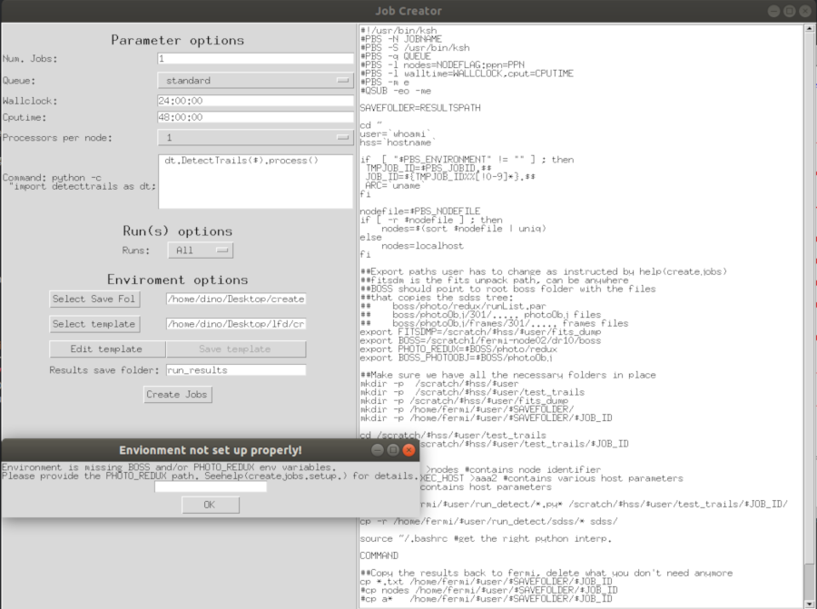

Creating DQS jobs
=================

.. toctree::
   :maxdepth: 2
   :caption: Contents:

To run the GUI import the package and use its `run` method or invoke the mainloop
of the app itself:

.. code-block:: python

   import lfd
   lfd.gui.jobcreator.run()

   # or optionally if one wants to potentially change default parameters
   import lfd.gui.imagechecker as imgchkr
   app = JobCreator()
   app.mainloop()

.. automodule:: lfd.gui.jobcreator
   :members:

.. automodule:: lfd.gui.jobcreator.rightframe
   :members:

.. automodule:: lfd.gui.jobcreator.leftframe
   :members:

.. automodule:: lfd.gui.jobcreator.lefttopframe
   :members:

.. automodule:: lfd.gui.jobcreator.leftmidframe
   :members:

.. automodule:: lfd.gui.jobcreator.leftbotframe
   :members:
