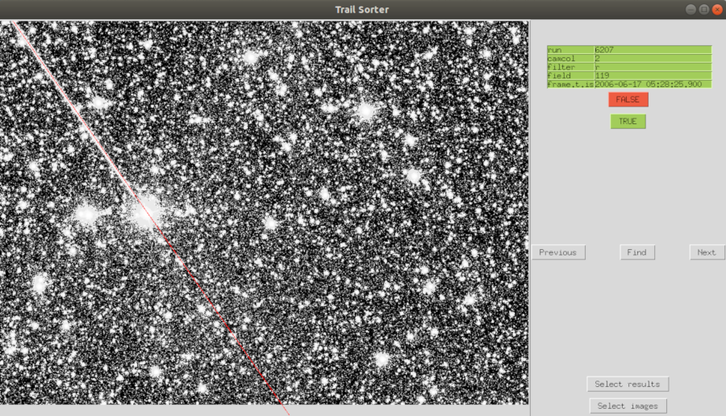
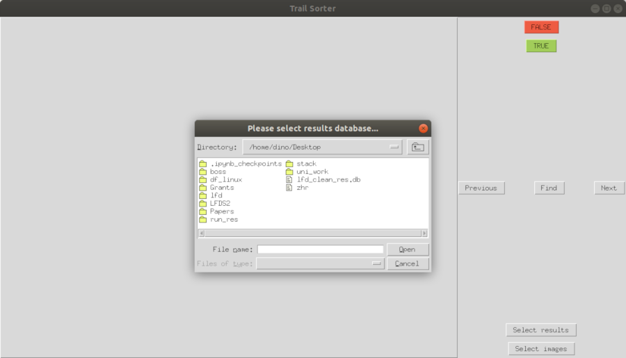

Verifying results 
=================

.. toctree::
   :maxdepth: 2
   :caption: Contents:

   imgchckr
   databrowser
   indexers
   utilities

.. automodule:: lfd.gui.imagechecker

To run the GUI import the package and use its `run` method or invoke the mainloop
of the app itself:

.. code-block:: python

   import lfd
   lfd.gui.imagechecker.run()

   # or optionally if one wants to potentially change default parameters
   import lfd.gui.imagechecker as imgchkr
   app = ImageChecker()
   app.mainloop()

The user should be greeted with popup windows instructing them to select the
results database first and the image database second. After successful
connections to the databases were made (notice that there is no setup required
as described in the :doc:`../../results/setup`, the values are inferred at
startup time from the selected DB's instead) user will be able to browse images
using directional keys and a mouse.

